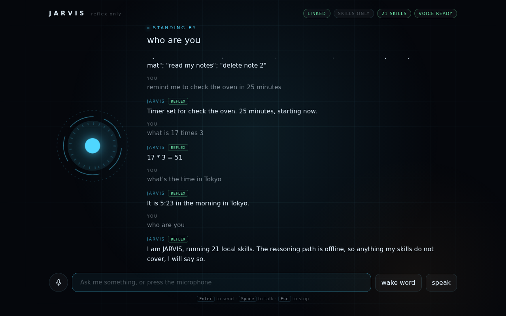

# JARVIS

A voice assistant with two ways of thinking: a **reflex path** that answers
instantly from regular expressions, and a **reasoning path** that hands the
sentence to Claude when the patterns do not fit.

Both paths run the same skills. A skill is written once.

```
$ jarvis serve
  JARVIS · 21 skills · Claude online
  HUD on http://127.0.0.1:7717
```



The browser handles the microphone and the speaking, so voice needs nothing
installed. Each reply is tagged with the path that produced it.

```
> set a timer for 10 minutes
  Timer set. 10 minutes, starting now.
  [reflex: set_timer]                        ← instant, offline, no API call

> I'm boiling an egg, nudge me when it's done
  · set_timer(duration=7.0, unit='minutes')
  Seven minutes, starting now. I'll tell you when.
  [brain: set_timer]                         ← same skill, reached by reasoning
```

---

## What I took from the jarvis-ai topic, and what I changed

I read through the projects on [github.com/topics/jarvis-ai](https://github.com/topics/jarvis-ai)
(197 repositories) before writing any code. The shape of the field:

| Project | Approach | What it does well |
|---|---|---|
| [GauravSingh9356/J.A.R.V.I.S](https://github.com/GauravSingh9356/J.A.R.V.I.S) | `speech_recognition` + `pyttsx3`, a long `if/elif` command chain | Enormous feature surface — email, news, YouTube, Wikipedia, face auth |
| [gia-guar/JARVIS-ChatGPT](https://github.com/gia-guar/JARVIS-ChatGPT) | Porcupine wake word, Whisper STT, LangChain agents, layered TTS | Graceful TTS fallbacks; genuinely agentic |
| [kishanrajput23/Jarvis-Desktop-Voice-Assistant](https://github.com/kishanrajput23/Jarvis-Desktop-Voice-Assistant) | Desktop automation, system-level commands | Actually controls the machine |
| [akshayaggarwal99/jarvis-ai-assistant](https://github.com/akshayaggarwal99/jarvis-ai-assistant) | TypeScript, native Mac app | Real product packaging |

Four things showed up again and again, and each one is a decision I made
differently:

**1. The dependency wall.** Nearly every Python entry needs PyAudio, which
needs PortAudio, which is the single most common reason these projects fail on
first run — before the user has heard a word. **So voice lives in the browser
here.** The HUD uses the Web Speech API for both recognition and synthesis, so
the microphone works with nothing installed at all. `pip install` of the core
package pulls in *zero* third-party packages. Native mic support is still there
(`jarvis listen`) for anyone who wants it, as an optional extra.

**2. The `if/elif` chain.** Command dispatch is typically one long chain of
string tests. It works, but it cannot tell you *why* it matched, it cannot be
tested a piece at a time, and adding an LLM means writing a **second** dispatch
table — a tool schema that duplicates every command and then drifts out of sync
with it. **So a skill declares its patterns and its JSON schema in one place**
and the two paths read the same declaration. `jarvis explain` prints the scoring
so routing is never a mystery.

**3. LLM-for-everything.** The newer projects route every utterance through a
model. "What time is it" then costs a network round trip, a few hundred
milliseconds, and a fraction of a cent — to answer a question `datetime` already
knows. **So patterns are tried first.** They are instant, free, deterministic,
and they work with the network down. Claude gets the sentences that actually
need thought.

**4. Failure that lies.** Several assistants say "opening it now" whether or not
a browser exists, and invent an answer when a lookup fails. **So every skill
here reports what really happened** — a headless box gets "I have no browser to
open here, so the link is on screen instead", and a failing tool returns the
error to the model rather than a plausible fiction.

---

## Install

```bash
git clone https://github.com/andrewmorales2027-oss/apple-.git
cd apple-
pip install -e .                  # core: no third-party dependencies
pip install -e ".[brain]"         # + Claude for the reasoning path
pip install -e ".[voice]"         # + native microphone (browser HUD needs neither)
```

The reasoning path switches itself on when the `anthropic` package and a
credential are both present:

```bash
export ANTHROPIC_API_KEY=sk-ant-...
```

`ant auth login` profiles are picked up too — the SDK resolves credentials, this
project never reads or stores your key.

Without a key, everything above still runs; you get the 21 local skills and an
honest "I do not have a skill for that" at the edges.

## Use

```bash
jarvis serve --open        # browser HUD: mic, wake word, spoken replies
jarvis                     # text session in the terminal
jarvis ask "what's the time in Tokyo"
jarvis listen              # native microphone loop
jarvis skills              # what it can do
jarvis explain "remind me to call mum in ten minutes"
```

`jarvis explain` is the debugging tool that the `if/elif` design cannot offer:

```
utterance : "remind me to call mum in ten minutes"
normalised: "remind me to call mum in ten minutes"
threshold : 0.55

ROUTED  1.00  set_timer            {'label': 'call mum', 'duration': 10.0, 'unit': 'minutes'}
```

Note that it heard "ten", not "10". Speech recognisers spell numbers out, so
spoken numbers are coerced through the parameter schema like any other capture
— "half an hour" and "twenty five minutes" both land as real durations.

## How it fits together

```
utterance
    │
    ▼
normalise ─────── strips "hey jarvis", "please", "thanks", punctuation
    │
    ▼
Router ────────── every skill scores the sentence; best score wins
    │
    ├── score ≥ threshold ──▶ run the skill directly           [reflex]
    │                         instant · offline · free
    │
    └── below threshold ───▶ Claude, holding the same skills   [brain]
                              as tools, streaming its answer
                                    │
                                    └──▶ tool_use ──▶ the same skill function
```

The score is how much of the sentence a pattern accounts for, so a pattern that
explains the whole utterance beats one that catches a fragment. Nothing above
the threshold means the sentence goes to Claude rather than to a skill that
would be confidently wrong.

## Skills

| Skill | Say |
|---|---|
| `get_time`, `get_date` | "what's the time in Tokyo", "what day is it" |
| `set_timer`, `list_timers`, `cancel_timers` | "remind me to stretch in 20 minutes" |
| `add_note`, `list_notes`, `delete_note`, `clear_notes` | "note that the spare key is under the mat" |
| `remember`, `recall` | "remember that my car is a blue Civic", "what's my car" |
| `calculate` | "what is 17 times 3" |
| `system_status` | "run diagnostics", "how much memory is free" |
| `open_website`, `web_search`, `wikipedia_lookup` | "open github", "who is Ada Lovelace" |
| `list_skills`, `greet`, `identify`, `thanks`, `reset_conversation` | "what can you do" |

Notes and remembered facts persist to `~/.jarvis/state.json` through atomic
writes, so a crash mid-save cannot corrupt them.

## Writing a skill

One declaration, both paths. Named groups in the patterns are the same
arguments as the properties in the schema:

```python
from jarvis import Reply, skill

@skill(
    "coffee",
    "Start the coffee machine and report how long it will take.",
    patterns=[r"\b(?:make|brew|start)(?: me)? (?:a |some )?coffee\b"],
    parameters={
        "strength": {
            "type": "string",
            "description": "How strong to make it.",
            "enum": ["mild", "normal", "strong"],
        }
    },
    examples=["make me a coffee"],
)
def coffee(ctx, strength: str = "normal") -> Reply:
    return Reply(speech=f"Brewing something {strength}. Two minutes.")
```

That is now both a regex route *and* a Claude tool. "Make me a coffee" hits the
pattern; "I'm falling asleep here, sort me out" reaches the same function
through the model.

A first parameter named `ctx` gets a `SkillContext` — config, memory,
scheduler, registry — so skills never import the assistant and stay testable on
their own. Declaring a pattern group that is missing from `parameters` raises at
import time rather than producing a broken tool call in production.

## Configuration

`jarvis.toml` in the working directory, or `JARVIS_*` environment variables
(`JARVIS_MODEL`, `JARVIS_REFLEX_THRESHOLD`, …). See `jarvis.toml.example`.

The two dials worth knowing:

- **`reflex_threshold`** (default `0.55`) — raise it to send more to Claude,
  lower it to keep more local.
- **`effort`** (default `medium`) — Claude's thinking depth. This, not disabled
  thinking, is the latency dial: switching thinking off on Opus 5 can put a tool
  call into the visible text instead of a `tool_use` block.

## Notes on the details

- **The calculator never calls `eval`.** It parses to an AST and walks it,
  allowing only arithmetic nodes, and rejects exponents big enough to hang the
  process.
- **The HUD server answers loopback only.** Cross-origin `POST`s and rebound
  `Host` headers are refused, so a random website cannot drive your assistant.
- **The system prompt is split at a cache breakpoint.** The persona and tool
  definitions are byte-stable and cacheable; per-turn state (the clock, running
  timers) sits *after* the breakpoint where changing it costs nothing.
- **Tool results from one turn go back in a single user message.** Splitting
  them trains the model to stop making parallel calls.
- **The tool loop is capped.** On the last round the tools are withheld, so a
  confused turn ends with words instead of looping.
- **Streaming is over Server-Sent Events**, not WebSockets: the traffic is
  one-directional, and SSE needs no dependency, handshake, or framing code.

## Tests

```bash
pip install -e ".[dev]"
python -m pytest
```

144 tests, no network required — the Claude tool loop is exercised against a
scripted fake client that asserts on the exact requests the brain builds.

## Licence

MIT.
